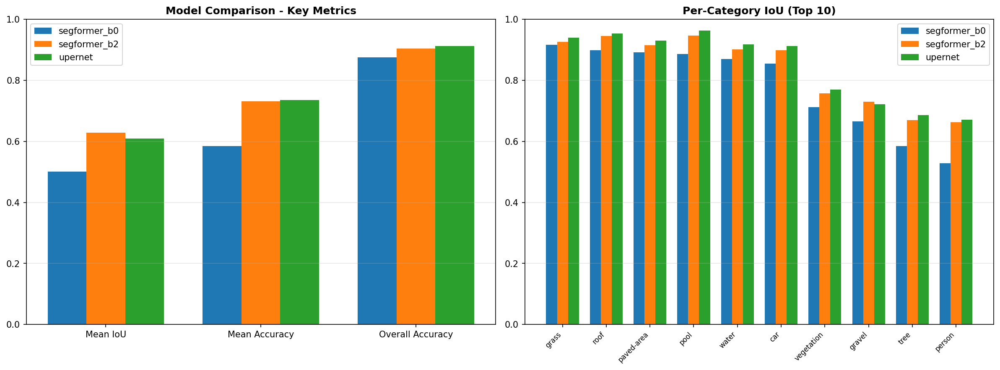

# 드론 항공 이미지 시맨틱 세그멘테이션 - 트랜스포머 모델 비교

> Hugging Face transformers 기반으로 SegFormer-B0, SegFormer-B2, UPerNet 세 모델을 같은 데이터·같은 학습 설정으로 비교
> 각 모델의 구조적 차이가 결과에 어떻게 드러나는지 확인하는 개인 학습용

---

## 참고 사항

* 데이터셋은 [Semantic Drone Dataset](https://www.kaggle.com/datasets/santurini/semantic-segmentation-drone-dataset)을 사용하였고, 24개 클래스의 항공 시점 픽셀 단위 라벨이 제공됩니다.
* 사전학습 가중치는 transformers 라이브러리의 `SegformerForSemanticSegmentation`과 `UperNetForSemanticSegmentation` 클래스의 `from_pretrained()` 메서드를 통해 불러왔으며, 체크포인트는 `nvidia/mit-b0`, `nvidia/mit-b2`, `openmmlab/upernet-swin-tiny`를 사용하였습니다.

---

## 학습 목적

같은 데이터와 같은 학습 설정에서 트랜스포머 계열 세그멘테이션 모델 3종을 비교하며, 모델별 구조적 차이가 클래스별 IoU와 추론 속도에 어떻게 반영되는지 확인하는 것입니다.

---

## 사용 환경


| 항목            | 사양                                      |
| ----------------- | ------------------------------------------- |
| Python          | 3.10+                                     |
| 핵심 라이브러리 | PyTorch, transformers, datasets, evaluate |
| GPU             | RTX 4060 (8GB VRAM)                       |
| 정밀도          | FP16 mixed precision                      |

---

## 데이터: Semantic Drone Dataset

### 어떻게 수집된 데이터인가

오스트리아 그라츠 공대(TU Graz)에서 공개한 데이터셋으로, 드론으로 주거 지역 상공을 촬영한 항공 이미지 400장과 픽셀 단위 시맨틱 라벨로 구성되어 있습니다. 원본 해상도는 6000×4000으로 매우 크기 때문에, 본 프로젝트에서는 학습 효율을 위해 512×512로 리사이즈하여 사용하였습니다.

### 클래스 구성 (24 클래스)

지면 (paved-area, dirt, grass, gravel, water, rocks, pool), 식생 (vegetation, tree, bald-tree), 건축물 (roof, wall, window, door, fence, fence-pole), 객체 (person, dog, car, bicycle), 마커 (ar-marker, obstacle), 그리고 unlabeled, conflicting의 24개 클래스로 구성됩니다.

클래스 간 픽셀 비율 불균형이 매우 큽니다. paved-area, grass, vegetation 같은 큰 영역이 전체 픽셀의 대부분을 차지하고, fence-pole, person, ar-marker 같은 작은 객체는 픽셀 수가 매우 적습니다. 이 불균형이 결과에서 어떻게 나타나는지가 본 비교의 주요 관심사 중 하나입니다.

### 데이터 분할

`seed=42`로 고정하여 Train 80% / Validation 10% / Test 10%로 분할하였고, 분할된 파일명 목록을 `split_info.json`으로 저장하여 평가 단계에서도 동일한 테스트셋을 사용하도록 하였습니다.

---

## 비교 모델 선정

### 가장 큰 제약: VRAM 8GB

솔직히 말하면 모델 선정의 1순위 기준은 **"RTX 4060 8GB에서 안정적으로 학습 가능한가"** 였습니다. Mask2Former-Large나 SegFormer-B4/B5 같은 무거운 모델은 OOM(Out Of Memory)으로 처음부터 후보에서 제외되었습니다. 결과적으로 후보군은 가벼운 트랜스포머 세그멘테이션 모델로 자연스럽게 좁혀졌고, 그 안에서 의미 있는 비교가 가능한 조합이 아래 세 모델입니다.

세 모델 모두 batch size 4, FP16 mixed precision으로 학습하였고, 이 설정에서 8GB VRAM에 안정적으로 들어갑니다. 더 큰 batch size를 시도하면 UPerNet과 B2가 OOM에 가까워져 batch size 4를 모든 모델 공통값으로 고정하였습니다. FP16을 사용한 것도 정확도가 아니라 메모리를 아끼기 위해서였습니다.

### 의미 있는 비교가 되도록 선정

VRAM 제약 안에서, "어떻게 멀티스케일 정보를 모으느냐"라는 설계 철학이 다른 세 모델을 골랐습니다. 그 차이가 결과에 어떻게 드러나는지 보고 싶었습니다.


| 모델             | 백본      | 사전학습 체크포인트           | 파라미터 수 |
| ------------------ | ----------- | ------------------------------- | ------------- |
| SegFormer-B0     | MiT-B0    | `nvidia/mit-b0`               | ~3.7M       |
| SegFormer-B2     | MiT-B2    | `nvidia/mit-b2`               | ~24.7M      |
| UPerNet (Swin-T) | Swin-Tiny | `openmmlab/upernet-swin-tiny` | ~60M        |

---

## 모델 아키텍처

### SegFormer (B0 / B2)

**구조**: Hierarchical Transformer Encoder (MiT) + All-MLP Decoder

```
Input → [Stage1] → [Stage2] → [Stage3] → [Stage4]
            ↓          ↓          ↓          ↓
            └──────────┴── MLP ───┴──────────┘
                           ↓
                      Concat & Fuse
                           ↓
                        Output
```

**인코더 (MiT, Mix Transformer)**: CNN처럼 4단계 계층적 피처를 만들지만 각 stage가 트랜스포머 블록으로 구성됩니다. ViT와 달리 위치 임베딩이 없으며(positional encoding-free), 대신 Mix-FFN이 컨볼루션으로 위치 정보를 내재화합니다. 학습/추론 해상도가 달라도 안정적으로 작동합니다.

**디코더**: 4개 stage의 피처를 가벼운 MLP로 합치는 것이 전부입니다. 디코더가 거의 없는 수준이라 추론 속도가 매우 빠릅니다.

**B0와 B2의 관계**: 동일한 구조에서 인코더 깊이와 채널 수만 다릅니다. "백본 크기 효과"를 단일 변수로 깨끗하게 비교할 수 있다는 점에서 이 두 가지를 함께 골랐습니다.

### UPerNet (Swin-Tiny 백본)

**구조**: Swin Transformer Encoder + UPerNet Decoder (PPM + FPN)

```
Input → [Swin Stage1] → [Stage2] → [Stage3] → [Stage4]
                                                  ↓
                                                 PPM   ← 다양한 크기로 풀링
                                                  ↓
        ┌──── FPN (top-down + lateral) ───────────┘
        ↓
   Multi-scale Fusion → Output
```

**인코더 (Swin Transformer)**: Shifted Window Attention을 사용합니다. 윈도우 안에서만 self-attention을 계산하다가, 다음 레이어에서 윈도우를 한 칸씩 밀어 윈도우 간 정보를 섞는 방식입니다. ViT의 O(N²) 복잡도를 O(N)으로 낮추면서도 광역 컨텍스트를 확보합니다.

**디코더 (UPerNet)**: 두 개의 모듈이 결합되어 있습니다.

* **PPM (Pyramid Pooling Module)**: 마지막 피처맵을 1×1, 2×2, 3×3, 6×6 크기로 평균 풀링한 뒤 다시 합칩니다. 전역 컨텍스트 확보용입니다.
* **FPN (Feature Pyramid Network)**: 위에서 아래로 정보를 흘려보내며 각 stage 피처에 더해줍니다. 세밀한 경계를 회복하는 역할입니다.

두 모듈을 함께 사용하여 "넓게 보면서도 디테일을 놓치지 않는" 구조를 만듭니다.

### 세 모델의 설계 차이 요약


| 항목           | SegFormer-B0/B2                       | UPerNet (Swin-T)                  |
| ---------------- | --------------------------------------- | ----------------------------------- |
| Attention 방식 | Efficient Self-Attn (다운샘플된 K, V) | Shifted Window Attn (윈도우 단위) |
| 위치 정보      | Mix-FFN (conv 내재화)                 | Relative Position Bias            |
| 디코더         | All-MLP (초경량)                      | PPM + FPN (멀티스케일 융합)       |
| 장점           | 빠름, 가벼움, 간결함                  | 큰 영역 일관성, 경계 디테일       |
| 단점           | 멀티스케일 융합이 단순                | 무겁고 느림                       |

---

## 학습 설정


| 하이퍼파라미터 | 값                      |
| ---------------- | ------------------------- |
| Epochs         | 50                      |
| Batch size     | 4                       |
| Learning rate  | 3e-5                    |
| Image size     | 512 × 512              |
| Optimizer      | AdamW (HF Trainer 기본) |
| Precision      | FP16                    |
| Best metric    | mean_iou                |

데이터 증강은 `ColorJitter(brightness=0.25, contrast=0.25, saturation=0.25, hue=0.1)`, `RandomHorizontalFlip(p=0.5)`, `RandomVerticalFlip(p=0.5)`을 적용하였습니다. Flip은 이미지와 라벨에 동일한 시드를 설정하여 같은 변환이 적용되도록 처리하였고, 라벨 마스크가 어긋나면 학습 자체가 무너지는 점에 주의가 필요하였습니다.

라벨 리사이즈 시에는 이미지에 BILINEAR, 라벨에 NEAREST를 사용하여 클래스 ID가 보존되도록 하였습니다.

---

## 파일 구성

```
drone_segmentation
├── train.ipynb     # 학습 파이프라인
├── eval.ipynb      # 평가 및 시각화
├── README.md
└── output/                            # 모델별 평가 결과
    ├── segformer_b0/ 
    │   └──eval_segformer_b0.json
    ├── segformer_b2/ 
    │   └──eval_segformer_b2.json
    ├── upernet/ 
    │   └──eval_upernet.json
    └── model_comparison.png
```

---

## 분석 전 예상

학습을 돌리기 전에, 모델 구조와 데이터 특성으로부터 어떤 결과가 나올지 미리 예상해 보았습니다.


| 항목                           | 예상                    | 근거                               |
| -------------------------------- | ------------------------- | ------------------------------------ |
| 전체 정확도 순위               | UPerNet > B2 > B0       | 파라미터 수와 디코더 표현력        |
| 큰 영역 (paved-area, grass)    | UPerNet 우세            | PPM의 전역 컨텍스트 묶음 효과      |
| 작은 객체 (window, bicycle)    | B2 > B0, UPerNet과 비슷 | 백본 깊이 효과 + 멀티스케일 디코더 |
| 추론 속도                      | B0 > B2 > UPerNet       | All-MLP 디코더 vs PPM+FPN          |
| 희귀 클래스 (door, fence-pole) | 모두 낮을 것            | 학습 픽셀 수 자체가 부족           |

---

## 단계별 결과와 확인한 것

### Step 1. 전체 메트릭 비교

테스트셋(40장)에 대한 50 epoch 후 최종 메트릭입니다.


| 모델             | Mean IoU   | Mean Accuracy | Overall Accuracy | Eval Loss | Speed (samples/s) |
| ------------------ | ------------ | --------------- | ------------------ | ----------- | ------------------- |
| SegFormer-B0     | 0.5015     | 0.5843        | 0.8756           | 0.426     | **24.3**          |
| SegFormer-B2     | **0.6279** | 0.7308        | 0.9048           | **0.306** | 17.5              |
| UPerNet (Swin-T) | 0.6091     | **0.7361**    | **0.9123**       | 0.428     | 2.5               |



**확인한 것**: Mean IoU 1위는 SegFormer-B2, Overall Accuracy 1위는 UPerNet으로 두 지표의 1위가 갈렸습니다. 속도는 예상대로 SegFormer-B0가 가장 빠르고, UPerNet은 평가 입력 해상도와 디코더 무게로 인해 B0의 약 1/10 수준입니다. 흥미로운 점은 SegFormer-B2가 mIoU 1위이면서 eval_loss(0.306)도 가장 낮아, 학습이 가장 안정적으로 수렴한 모델이라는 것입니다.

**여기서 알게 된 것**: Mean IoU와 Overall Accuracy의 차이는 클래스 불균형 데이터를 다룰 때 반드시 함께 봐야 하는 이유를 보여줍니다. UPerNet은 Overall Accuracy가 91.2%로 가장 높지만 Mean IoU는 60.9%로, 큰 영역에서는 잘 맞히지만 작은/희귀 클래스에서는 상대적으로 약합니다. SegFormer-B0는 Overall Accuracy가 87.6%로 나쁘지 않아 보이지만, Mean IoU는 50.2%에 그쳐 클래스별 편차가 매우 크다는 것을 알 수 있습니다.

### Step 2. 큰 영역 클래스 (UPerNet 가설 검증)


| 클래스     | B0 IoU | B2 IoU | UPerNet IoU |
| ------------ | -------- | -------- | ------------- |
| paved-area | 0.891  | 0.916  | **0.931**   |
| grass      | 0.916  | 0.926  | **0.940**   |
| pool       | 0.886  | 0.947  | **0.963**   |
| water      | 0.869  | 0.902  | **0.918**   |
| roof       | 0.898  | 0.945  | **0.953**   |
| car        | 0.855  | 0.898  | **0.913**   |

**확인한 것**: 예상대로 UPerNet이 모든 큰 영역 클래스에서 최고 성능을 기록하였습니다. 모든 큰 영역에서 B0 < B2 < UPerNet 순서로 매우 깔끔한 단조 증가 패턴을 보입니다.

**여기서 알게 된 것**: PPM의 전역 컨텍스트 풀링이 큰 영역의 일관성에 실제로 도움이 됩니다. 큰 영역에 한정해서 보면 모델 크기/표현력에 비례해 성능이 올라가는 깨끗한 경향이 나타나며, 이는 큰 영역이 학습 자체는 어렵지 않고 디코더 표현력이 추가 이득을 만든다는 의미입니다.

### Step 3. 작은 객체 및 텍스처 복잡 클래스 (백본 크기 효과)

SegFormer-B0에서 SegFormer-B2로 백본을 키울 때 IoU 개선폭이 가장 큰 클래스를 추렸습니다.


| 클래스    | B0 IoU | B2 IoU | 개선폭     |
| ----------- | -------- | -------- | ------------ |
| ar-marker | 0.186  | 0.811  | **+0.625** |
| window    | 0.039  | 0.418  | **+0.379** |
| rocks     | 0.175  | 0.437  | +0.262     |
| fence     | 0.243  | 0.461  | +0.217     |
| bicycle   | 0.233  | 0.424  | +0.192     |
| obstacle  | 0.399  | 0.554  | +0.155     |
| wall      | 0.444  | 0.579  | +0.135     |

**확인한 것**: 백본을 키울 때 가장 큰 이득을 보는 클래스는 작고 텍스처가 복잡한 객체들입니다. ar-marker는 무려 +0.625로 IoU가 4배 이상 뛰었고, window도 거의 사용 불가 수준(0.039)에서 실용 가능한 수준(0.418)으로 개선되었습니다. 반면 grass, paved-area 같은 큰 영역 클래스는 이미 B0에서도 IoU 0.9 이상으로 충분히 학습되어 개선폭이 +0.01~0.02 수준에 그칩니다.

**여기서 알게 된 것**: "모델을 크게 키우면 모든 게 좋아진다"가 아니라, 모델 크기 증가의 이득은 학습이 어려운 클래스에 집중적으로 배분됩니다. 따라서 데이터의 클래스 분포를 보고 어떤 모델 크기가 적절한지 판단할 수 있습니다.

### Step 4. 학습 실패 클래스


| 클래스     | B0 IoU | B2 IoU | UPerNet IoU |
| ------------ | -------- | -------- | ------------- |
| door       | 0.000  | 0.000  | 0.000       |
| fence-pole | 0.000  | 0.000  | 0.000       |
| dog        | NaN    | NaN    | NaN         |

**확인한 것**: door와 fence-pole은 세 모델 모두 IoU 0으로 완전히 실패하였습니다. dog는 NaN으로 표시되는데, 이는 테스트셋에 dog가 한 픽셀도 없다는 의미입니다(IoU 계산이 정의되지 않음).

**원인 분석**:

1. **door**: 데이터셋 전체에서 door 픽셀 비율이 매우 낮고, 게다가 항공 시점에서는 문이 잘 보이지 않습니다(지붕이나 외벽이 가림). 24 클래스 중 가장 학습이 어려운 클래스입니다.
2. **fence-pole**: 매우 얇은 구조물이라 512×512로 다운샘플하는 과정에서 1~2 픽셀 폭으로 줄어들거나 아예 사라집니다. 더 큰 입력 해상도가 필요한 클래스입니다.
3. **dog**: 데이터셋 자체에 워낙 적게 등장하여 테스트 분할에 한 장도 들어가지 않았습니다. 분할 시 stratified sampling이 필요한 사례입니다.

**여기서 알게 된 것**: 클래스별 IoU를 보면 단순히 "어느 모델이 좋다"가 아니라 "데이터셋의 어떤 부분이 학습 자체가 어려운 영역인지"가 드러납니다. 이런 클래스는 모델을 바꿔서 해결할 문제가 아니라 데이터 측면(클래스 가중치, 해상도, 샘플링)에서 접근해야 합니다.

### Step 5. 속도 vs 정확도 트레이드오프


| 모델             | Mean IoU | Speed (samples/s) | 상대 속도 (B0=1.0) |
| ------------------ | ---------- | ------------------- | -------------------- |
| SegFormer-B0     | 0.5015   | 24.3              | 1.00               |
| SegFormer-B2     | 0.6279   | 17.5              | 0.72               |
| UPerNet (Swin-T) | 0.6091   | 2.5               | 0.10               |

**확인한 것**: SegFormer-B0 → B2는 속도가 약 28% 감소하면서 mIoU가 +0.126 증가하는 좋은 트레이드오프를 보입니다. 반면 UPerNet은 B0 대비 속도가 1/10 수준으로 떨어지는데, mIoU는 B2보다 오히려 낮습니다.

**여기서 알게 된 것**: 같은 8GB GPU 환경에서 본 비교에 한정하면, **SegFormer-B2가 정확도와 속도 양쪽에서 가장 합리적인 선택**입니다. 실시간성이 절대적으로 필요한 응용이라면 SegFormer-B0이 후보가 되며, UPerNet은 큰 영역 일관성이 중요한 오프라인 분석에서만 의미가 있습니다.

---

## 예상 vs 실제 요약


| 항목                     | 예상              | 실제                             | 일치      |
| -------------------------- | ------------------- | ---------------------------------- | ----------- |
| 전체 정확도 순위         | UPerNet > B2 > B0 | mIoU: B2 > UPerNet > B0          | 부분 일치 |
| 큰 영역에서 UPerNet 우세 | UPerNet 1위       | 모든 큰 영역에서 UPerNet 1위     | 일치      |
| 작은 객체에서 B2 우세    | B2 > B0           | window, ar-marker 등에서 B2 압승 | 일치      |
| 추론 속도                | B0 > B2 > UPerNet | 24.3 > 17.5 > 2.5                | 일치      |
| 희귀 클래스 학습 실패    | 모두 낮을 것      | door 0.000, fence-pole 0.000     | 일치      |

가장 의외였던 부분은 Mean IoU에서 SegFormer-B2가 UPerNet을 앞섰다는 점입니다. 디코더가 더 정교한 UPerNet이 mIoU도 1위일 것으로 예상했지만, 실제로는 인코더-디코더 상성이 더 중요했던 것으로 보입니다. SegFormer는 인코더와 디코더가 함께 설계된 통합 구조인 반면, UPerNet은 이미 만들어진 Swin 백본 위에 별도의 디코더를 얹은 구조여서 융합 효율에 차이가 있을 수 있습니다.

또한 SegFormer-B2의 eval_loss(0.306)가 다른 두 모델(0.426, 0.428)보다 현저히 낮다는 점도 주목할 만합니다. mIoU 차이는 작아 보이지만 손실 측면에서는 가장 안정적으로 수렴한 모델이며, 이는 B2가 본 데이터셋의 다양한 클래스에 가장 균형 있게 적응했다는 신호로 해석됩니다.

---

## 학습을 통해 배운 것

**Mean IoU와 Overall Accuracy를 함께 봐야 하는 이유를 체감하였습니다.** UPerNet의 결과(Overall Accuracy 91.2%, Mean IoU 60.9%)와 SegFormer-B0의 결과(Overall Accuracy 87.6%, Mean IoU 50.2%)에서, 두 지표 중 하나만 봤다면 모델의 강점과 약점을 정확히 파악하지 못했을 것입니다. 특히 B0는 Overall Accuracy로만 보면 그럭저럭 작동하는 것처럼 보이지만, 클래스별로 보면 window IoU 0.039, ar-marker IoU 0.186 등 사용 불가 수준의 클래스가 다수 존재합니다.

**모델 구조와 결과의 연결을 직접 검증하는 경험을 얻었습니다.** "PPM이 전역 컨텍스트를 묶어줄 것이다", "All-MLP 디코더는 빠를 것이다" 같은 가설을 미리 세우고 결과로 확인하니, 단순히 수치만 보는 것보다 모델의 작동 원리를 더 깊이 이해할 수 있었습니다.

**모델 크기 증가의 이득은 균등하지 않다는 것을 알게 되었습니다.** B0 → B2로 백본을 키웠을 때 grass, paved-area는 거의 변화가 없는 반면 ar-marker는 IoU가 4배 이상(0.186 → 0.811)으로 뛰었습니다. 데이터셋의 어떤 클래스가 학습이 어려운지를 먼저 파악하고, 그에 맞춰 모델 크기를 결정해야 한다는 것을 배웠습니다.

**클래스별 IoU가 0인 경우는 모델 문제가 아닐 수 있다는 것을 알게 되었습니다.** door와 fence-pole이 모든 모델에서 IoU 0인 것은 모델 문제가 아니라 데이터 자체의 한계(픽셀 부족, 항공 시점에서의 가시성, 다운샘플 시 소실)였습니다. 결과를 분석할 때 모델 vs 데이터 중 어느 쪽 문제인지를 먼저 구분하는 사고 흐름이 필요하다는 것을 배웠습니다.

---

## 다시 한다면

* 클래스 가중치를 적용하여 door, fence-pole 같은 희귀 클래스에 가중 손실을 부여
* 입력 해상도를 768 또는 1024로 올려 fence-pole 같은 얇은 구조물 보존
* Test-time augmentation (수평/수직 flip 평균)으로 추가 성능 확보
* SegFormer-B4 또는 Mask2Former를 추가 비교 (더 큰 GPU 환경에서)
* 클래스 분포를 고려한 stratified split으로 dog 같은 클래스의 NaN 방지
* Gradient accumulation으로 실효 batch size를 키워 학습 안정성 확인
* epoch 수를 늘려 충분히 수렴된 모델로 비교할 필요가 있음

---

## 참고 자료

* [SegFormer: Simple and Efficient Design for Semantic Segmentation (NeurIPS 2021)](https://arxiv.org/abs/2105.15203)
* [Swin Transformer (ICCV 2021)](https://arxiv.org/abs/2103.14030)
* [UPerNet: Unified Perceptual Parsing (ECCV 2018)](https://arxiv.org/abs/1807.10221)
* [Hugging Face Semantic Segmentation Tutorial](https://huggingface.co/docs/transformers/tasks/semantic_segmentation)
* [Semantic Drone Dataset](https://www.kaggle.com/datasets/santurini/semantic-segmentation-drone-dataset)

---

## 라이선스

이 프로젝트는 학습 및 포트폴리오 목적으로 작성되었습니다.

* 학습 파이프라인 - 10가지 프로젝트로 끝내는 트랜스포머 활용 가이드 with 파이토치 기반으로 재구성
* 데이터셋 - TU Graz Semantic Drone Dataset (학술 비상업적 용도 공개)
* 사전학습 가중치 - transformers 라이브러리를 통해 불러온 NVIDIA / OpenMMLab 공개 체크포인트
