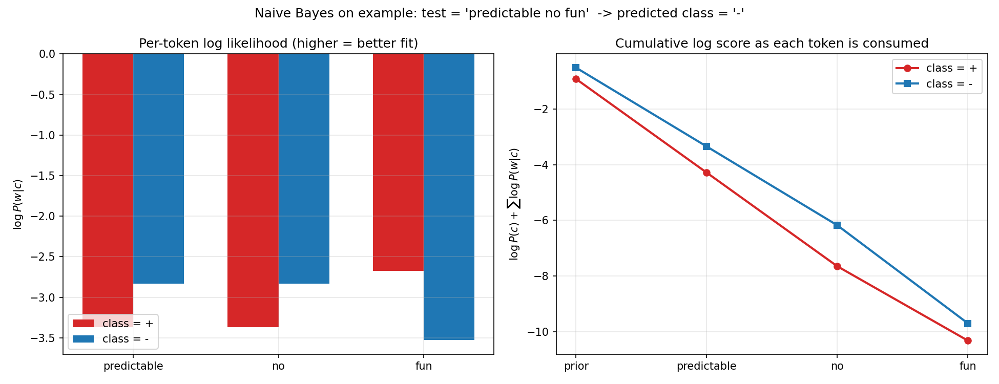
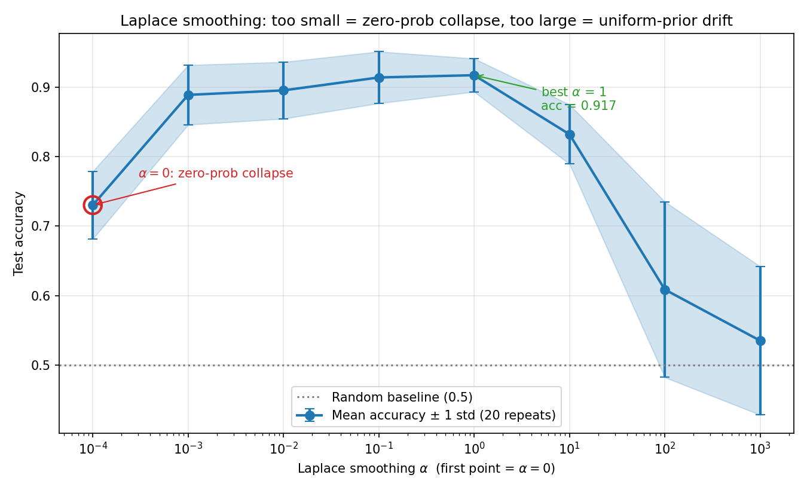
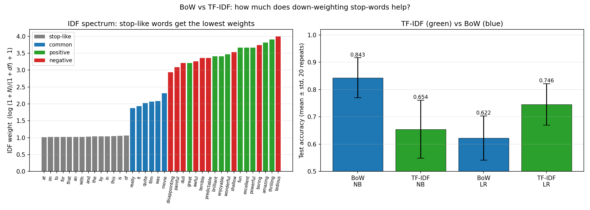
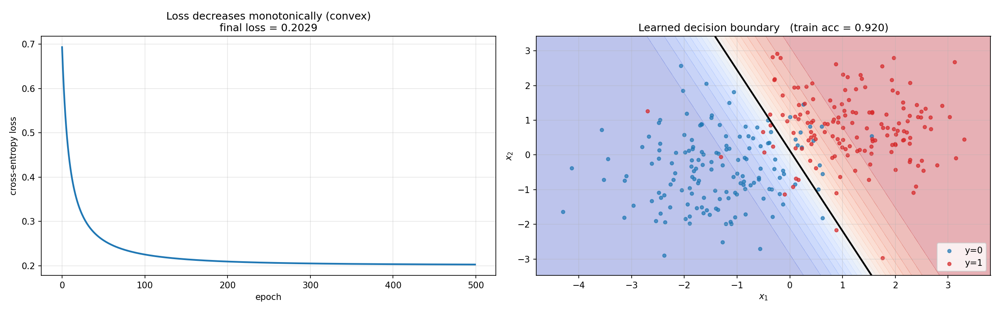

# Topic 2: Text Classification

## 목차

1. [Text Classification 이란](#1-text-classification-이란)
2. [Rule-based vs Supervised Learning](#2-rule-based-vs-supervised-learning)
3. [Naive Bayes Classifier](#3-naive-bayes-classifier)
4. [Laplace Smoothing](#4-laplace-smoothing)
5. [Sparse Representation & TF-IDF](#5-sparse-representation--tf-idf)
6. [Logistic Regression](#6-logistic-regression)
7. [Regularization](#7-regularization)
8. [Multinomial Logistic Regression](#8-multinomial-logistic-regression)
9. [Naive Bayes vs Logistic Regression](#9-naive-bayes-vs-logistic-regression)

---

## 1. Text Classification이란

**텍스트 분류(text classification)**는 입력 문서 $d$를 미리 정의된 클래스 집합 $\mathcal{C} = \{c_1, c_2, \dots, c_m\}$ 중 하나로 대응시키는 문제다.

$$
F: \mathcal{D} \to \mathcal{C}, \qquad F(d) = \hat{c} \in \mathcal{C}
$$


| 응용                    | 입력           | 출력                       |
| ------------------------- | ---------------- | ---------------------------- |
| Sentiment analysis      | 영화 리뷰 문장 | positive / negative        |
| Document categorization | 뉴스 기사      | 정치 / 경제 / 스포츠 / ... |
| Spam detection          | 이메일         | spam / ham                 |
| Toxic content detection | 댓글           | toxic / non-toxic          |
| Intent classification   | 사용자 발화    | 의도 라벨                  |

입력 단위는 꼭 문서(document)일 필요 없이 **단어, 문장, 구(phrase), 문단** 어느 것이든 될 수 있다. 여기서는 편의상 "문서" 로 부른다.

---

## 2. Rule-based vs Supervised Learning

### 2.1 Rule-based 접근

전문가가 직접 규칙을 작성하는 방식.

```
IF ∃ w ∈ d such that w ∈ {good, great, extraordinary, ...}
    THEN output Positive
```

- (+) 규칙이 정교하면 매우 정확할 수 있음.
- (−) 규칙 정의 비용이 크고, 새로운 도메인으로 일반화가 어려움. 규칙 자체를 사람이 **알지 못하는** 경우도 많음.

### 2.2 Supervised Learning 접근

레이블이 붙은 학습 데이터 $\{(d_i, c_i)\}_{i=1}^{n}$ 로부터 분류기 $F: \mathcal{D} \to \mathcal{C}$ 를 직접 학습한다. 설계자는 두 가지만 결정한다.

1. $F$의 **형태(form)** - 선형 모델? 확률 모델? 신경망?
2. $F$를 어떻게 **학습(learn)** 할 것인가 - 목적 함수 + 최적화 방법.

여기서는 두 가지 대표적인 supervised 텍스트 분류기를 다룬다.


| 모델                    | 접근           | 모델링 대상                                                   |
| ------------------------- | ---------------- | --------------------------------------------------------------- |
| **Naive Bayes**         | generative     | $P(d \mid c)\,P(c)$ - 각 클래스가 문서를 어떻게 "생성" 하는지 |
| **Logistic Regression** | discriminative | $P(c \mid d)$ 를 직접                                         |

---

## 3. Naive Bayes Classifier

### 3.1 Bayes Rule로부터의 유도

주어진 문서 $d$에 대해 가장 그럴듯한 클래스 $c$를 고르는 문제는 다음과 같다.

$$
c_{\text{MAP}} = \arg\max_{c \in \mathcal{C}} P(c \mid d)

$$

Bayes rule을 적용하면

$$
c_{\text{MAP}} = \arg\max_{c} \frac{P(d \mid c)\,P(c)}{P(d)}

$$

분모 $P(d)$는 $c$에 무관하므로 argmax에서 빠진다.

$$
\boxed{\;c_{\text{MAP}} = \arg\max_{c \in \mathcal{C}}\; \underbrace{P(d \mid c)}_{\text{likelihood}}\; \underbrace{P(c)}_{\text{prior}}\;}

$$

- **Prior** $P(c)$: 클래스 $c$가 사전적으로 얼마나 자주 등장하는가?
- **Likelihood** $P(d \mid c)$: 클래스 $c$인 문서에서 이런 내용이 나올 확률은?

### 3.2 Bag-of-Words 가정 (조건부 독립)

문서를 단어 수열 $d = (w_1, w_2, \dots, w_K)$ 로 보면

$$
P(d \mid c) = P(w_1, w_2, \dots, w_K \mid c)

$$

그런데 가능한 단어 수열이 너무 많아 직접 추정은 불가능하다. 이를 해결하기 위해 두 가지 단순화 가정을 둔다.

1. **Position 무시**: 단어의 위치는 상관없다.
2. **조건부 독립**: 클래스 $c$가 주어지면 단어들은 서로 독립.

$$
P(w_1, \dots, w_K \mid c) \;\approx\; \prod_{i=1}^{K} P(w_i \mid c)

$$

이 두 가정 아래 모델이 문서를 보는 방식이 **Bag-of-Words (BoW)** - 단어가 어떤 봉투 안에 섞여 있을 뿐, 순서,위치,문맥은 모두 버린다.

### 3.3 예측식 (Prediction)

수치 안정성을 위해 log 공간에서 계산한다.

$$
\boxed{\;c_{\text{MAP}} = \arg\max_{c \in \mathcal{C}}\; \log P(c) + \sum_{i=1}^{K} \log P(w_i \mid c)\;}

$$

### 3.4 MLE로 파라미터 추정

학습 데이터 $\{(d_i, c_i)\}_{i=1}^n$이 주어졌을 때 maximum likelihood 추정은

$$
\hat{P}(c_j) = \frac{\mathrm{Count}(c_j)}{n}

$$

$$
\hat{P}(w_i \mid c_j) = \frac{\mathrm{Count}(w_i, c_j)}{\sum_{w \in \mathcal{V}} \mathrm{Count}(w, c_j)}

$$

- $\mathrm{Count}(c_j)$: 클래스 $c_j$에 속한 문서의 수
- $\mathrm{Count}(w_i, c_j)$: 클래스 $c_j$ 문서들에서 단어 $w_i$가 등장한 총 횟수
- $\mathcal{V}$: 학습 데이터의 전체 어휘(vocabulary)

### 3.5 worked example

Train corpus (5 documents):


| Cat | Document                              |
| ----- | --------------------------------------- |
| −  | just plain boring                     |
| −  | entirely predictable and lacks energy |
| −  | no surprises and very few laughs      |
| +   | very powerful                         |
| +   | the most fun film of the summer       |

Test: `predictable with no fun` ("with" 는 stop word로 제거 -> `predictable no fun`)

Prior:

$$
P(-) = \frac{3}{5}, \qquad P(+) = \frac{2}{5}

$$

Vocabulary $|\mathcal{V}| = 20$, $\sum_w \mathrm{Count}(w, -) = 14$, $\sum_w \mathrm{Count}(w, +) = 9$.

Laplace smoothing $(\alpha = 1)$을 적용한 조건부 확률:

$$
P(\text{predictable} \mid -) = \frac{1+1}{14+20} = \frac{2}{34}, \quad
P(\text{predictable} \mid +) = \frac{0+1}{9+20} = \frac{1}{29}

$$

$$
P(\text{no} \mid -) = \frac{2}{34}, \quad P(\text{no} \mid +) = \frac{1}{29}, \quad
P(\text{fun} \mid -) = \frac{1}{34}, \quad P(\text{fun} \mid +) = \frac{2}{29}

$$

최종 스코어:

$$
P(-) \cdot P(S \mid -) = \frac{3}{5} \cdot \frac{2 \cdot 2 \cdot 1}{34^3} \approx 6.1 \times 10^{-5}

$$

$$
P(+) \cdot P(S \mid +) = \frac{2}{5} \cdot \frac{1 \cdot 1 \cdot 2}{29^3} \approx 3.3 \times 10^{-5}

$$

-> **예측 = negative**.



### 3.6 Binary Naive Bayes

감성 분류 같은 작업에서는 단어의 **등장 여부** 가 **등장 횟수** 보다 더 중요하다. "fantastic"이 한 번 나왔다는 사실이 감정을 강하게 알려주지만, 5번 나왔다고 해서 그보다 5배 더 많은 정보를 주진 않는다.

-> 해결: 각 문서에서 단어 카운트를 1로 clipping 한 뒤 학습.

### 3.7 Pros and Cons


| Pros                                                      | Cons                              |
| ----------------------------------------------------------- | ----------------------------------- |
| 매우 빠름, 작은 메모리                                    | 독립 가정이 실제로는 대부분 깨짐  |
| 적은 학습 데이터에서도 잘 작동                            | 클래스 불균형에 취약              |
| 무관한 feature 에 강건 (상쇄됨)                           | 복잡한 feature 상호작용 포착 불가 |
| 동등하게 중요한 feature 많을 때 유리 (결정트리 단점 회피) |                                   |

---

## 4. Laplace Smoothing

### 4.1 Data sparsity 문제

MLE 추정은 "한 번도 못 본" 조합에 대해 확률 0을 부여한다. 예를 들어 학습 데이터에 `('fantastic', Positive)` 조합이 없으면:

$$
\hat{P}(\text{fantastic} \mid +) = 0

$$

이 단어가 테스트 문서에 한 번이라도 등장하면

$$
\log P(+) + \sum_i \log P(w_i \mid +) = -\infty

$$

즉 해당 클래스의 점수가 음의 무한대로 붕괴한다 (**zero-probability collapse**).

### 4.2 Laplace add-α smoothing

모든 카운트에 $\alpha > 0$을 더해 준다:

$$
\boxed{\;\hat{P}(w_i \mid c_j) = \frac{\mathrm{Count}(w_i, c_j) + \alpha}{\sum_{w \in \mathcal{V}} \mathrm{Count}(w, c_j) + \alpha |\mathcal{V}|}\;}

$$

- $\alpha = 0$: 기존 MLE (zero-prob 위험).
- $\alpha = 1$: 가장 흔한 선택 ("add-one smoothing", Laplace).
- $\alpha \to \infty$: 모든 조건부 확률이 균등분포 $1/|\mathcal{V}|$ 로 수렴 -> 단어가 주는 정보 상실.

### 4.3 실험: α 스윕

합성 감성 corpus 에서 $\alpha$를 바꿔가며 테스트 정확도를 측정한 결과:


|  $\alpha$ |   Test Accuracy   | 메모                      |
| ----------: | :------------------: | --------------------------- |
|       $0$ |   0.730 ± 0.049   | zero-prob collapse        |
| $10^{-3}$ |       0.889       |                           |
| $10^{-1}$ |       0.914       |                           |
|       $1$ | **0.917** ± 0.024 | ★ 최적                   |
|      $10$ |       0.832       |                           |
|  $10^{2}$ |       0.609       |                           |
|  $10^{3}$ |       0.535       | uniform drift (랜덤 수준) |

분류 정확도는 $\alpha$에 대해 **U-shape**를 그린다: 너무 작으면 zero-prob에 당하고, 너무 크면 사전 정보가 균등분포를 과도하게 주입해 데이터가 주는 신호를 덮어 버린다. 표준 선택 $\alpha = 1$이 합리적인 지점임을 경험적으로 확인할 수 있다.



---

## 5. Sparse Representation & TF-IDF

### 5.1 Sparse Representation이란

문서 $d$를 고정된 $n$차원 벡터로 표현한다.

$$
d \;\longrightarrow\; \mathbf{x} = (f_1, f_2, \dots, f_n) \in \mathbb{R}^n

$$

각 차원(= feature)은 어떤 단어 또는 규칙을 나타내며, 대부분의 차원은 0이 되는 게 일반적이다 - 이 때문에 **sparse** 라고 부른다.

### 5.2 Rule-based feature (예: 스팸 탐지)

```
f1 = URL 개수                    → 3
f2 = unique URL 개수              → 2
f3 = 이메일 주소 개수             → 0
f4 = 영숫자 혼합 단어 개수         → 2
f5 = 영문자만으로 구성된 단어 개수  → 20
f6 = 15자 이상 단어 개수          → 0
```

-> $\mathbf{x} = [3, 2, 0, 2, 20, 0]$. NB의 likelihood는 이 경우에도 그대로 확장된다:

$$
P(d \mid c) \approx \prod_{j=1}^{n} P(f_j \mid c)

$$

### 5.3 TF-IDF

단어 수준에서 "**이 문서에서 얼마나 자주 나오는가**(TF)"만 보는 BoW에는 흠이 있다 - 'the', 'is' 같은 단어도 높은 빈도로 등장하지만 문서 특성을 잘 드러내는 단어는 아니다. TF-IDF는 이 문제를 **문서 간 분포**를 보는 IDF로 완화한다.

$$
\text{TF}(t, d) = \frac{\#\{t \text{ in } d\}}{\#\{\text{terms in } d\}}

$$

$$
\text{IDF}(t) = \log \frac{N}{df(t)}

$$

- $N$: 전체 문서 수
- $df(t)$: 단어 $t$가 등장한 문서 수

$$
\boxed{\;\text{TF-IDF}(t, d) = \text{TF}(t, d) \cdot \text{IDF}(t)\;}

$$

문서 하나에 자주 나오고(TF↑) 코퍼스 전체에서는 드문(IDF↑) 단어가 높은 가중치를 받는다.

### 5.4 IDF 예시

3개 문서 $D_1 =$ "cat sits on the mat", $D_2 =$ "dog barks at the cat", $D_3 =$ "mouse runs under the mat" 에서:

$$
\text{IDF}(\text{cat}) = \log\frac{3}{2} \approx 0.176, \qquad
\text{IDF}(\text{dog}) = \log\frac{3}{1} \approx 0.477

$$

두 문서에 등장한 "cat"보다, 한 문서에만 등장한 "dog"가 더 큰 IDF 값을 갖는다.

### 5.5 실험: BoW vs TF-IDF

감성 분류 합성 corpus(긍/부정 신호 단어 소량 + stop-like 공통어 다량)에서, 학습 데이터가 적을 때 두 표현의 차이를 측정한 결과:


| Representation | Model               |   Test Accuracy   |
| ---------------- | --------------------- | :------------------: |
| BoW            | Multinomial NB      |   0.843 ± 0.073   |
| **TF-IDF**     | Multinomial NB      |   0.654 ± 0.106   |
| BoW            | Logistic Regression |   0.622 ± 0.081   |
| **TF-IDF**     | Logistic Regression | **0.746** ± 0.076 |

두 가지 관찰:

1. **LR + TF-IDF**(0.746)가 **LR + BoW**(0.622) 대비 +12%p 향상 — TF-IDF가 stop-like 단어의 영향을 억제해 gradient에 잡음이 덜 섞인다.
2. **NB + TF-IDF**는 오히려 불리 - Multinomial NB는 정수 count에 대한 generative model이라 TF-IDF의 실수 값에 맞지 않는다. 실무적으로 중요한 포인트: **feature와 모델은 궁합이 있다**.

IDF 스펙트럼 시각화에서 실제로 stop-like 단어들은 모두 1.0 근처, 감성 단어들은 3~4로 확연히 구분됨을 확인할 수 있다.



---

## 6. Logistic Regression

### 6.1 Discriminative 접근

NB 가 generative($P(d \mid c) P(c)$ 를 모델링) 였다면, LR 은 **$P(c \mid d)$를 직접** 모델링한다.

### 6.2 Sigmoid 와 분류 함수 (binary)

입력 feature 벡터 $\mathbf{x} = (x_1, \dots, x_k)$, 가중치 $\mathbf{w} = (w_1, \dots, w_k)$, 편향 $b$에 대해:

$$
z = \mathbf{w} \cdot \mathbf{x} + b

$$

$$
\hat{y} = P(y = 1 \mid \mathbf{x}) = \sigma(z) = \frac{1}{1 + e^{-z}}

$$

$$
P(y = 0 \mid \mathbf{x}) = 1 - \sigma(z)

$$

예측 규칙:

$$
\hat{c} = \begin{cases} 1 & \text{if } \hat{y} > 0.5 \\ 0 & \text{otherwise} \end{cases}

$$

### 6.3 sentiment 예제

Feature 정의:


| Var   | 의미                     | Value |
| ------- | -------------------------- | :-----: |
| $x_1$ | positive lexicon 단어 수 |   3   |
| $x_2$ | negative lexicon 단어 수 |   2   |
| $x_3$ | "no" 등장 여부           |   1   |
| $x_4$ | 1,2 인칭 대명사 수       |   3   |
| $x_5$ | "!" 등장 여부            |   0   |
| $x_6$ | $\ln(\#\text{words})$    | 4.19 |

가중치 $\mathbf{w} = [2.5,\, -5.0,\, -1.2,\, 0.5,\, 2.0,\, 0.7]$, $b = 0.1$.

$$
z = \mathbf{w}\cdot\mathbf{x} + b \approx 0.805

$$

$$
P(+ \mid \mathbf{x}) = \sigma(0.805) \approx 0.69, \qquad P(- \mid \mathbf{x}) \approx 0.31

$$

### 6.4 Cross-Entropy Loss

$n$개 샘플 $(\mathbf{x}_i, y_i)$ 에 대해 모델 확률:

$$
\prod_{i=1}^{n} P(y_i \mid \mathbf{x}_i) = \prod_{i=1}^{n} \hat{y}_i^{\,y_i} (1 - \hat{y}_i)^{1 - y_i}

$$

Negative log-likelihood를 loss 로 사용:

$$
\boxed{\;L_{\text{CE}} = -\sum_{i=1}^{n} \left[\, y_i \log \hat{y}_i + (1 - y_i) \log (1 - \hat{y}_i) \,\right]\;}

$$

**CE loss 의 값 범위**: $[0, \infty)$. 완벽한 예측이면 0, 틀릴수록 무한대로 발산. 낮을수록 좋은 분류기.

sanity check:


| True$y$ | $\hat{y}$ |       $L_\text{CE}$       |
| :-------: | :---------: | :-------------------------: |
|  $y=1$  |   0.69   | $-\log 0.69 \approx 0.37$ |
|  $y=0$  |   0.69   | $-\log 0.31 \approx 1.17$ |

-> 틀렸을 때의 loss(1.17) 가 맞았을 때(0.37) 보다 훨씬 크다.

### 6.5 Gradient

$$
\frac{\partial L_\text{CE}}{\partial w_j} = \sum_{i=1}^{n} (\hat{y}_i - y_i)\, x_{i,j}

$$

$$
\frac{\partial L_\text{CE}}{\partial b} = \sum_{i=1}^{n} (\hat{y}_i - y_i)

$$

형태가 매우 간결하다 - "예측 오차 $(\hat{y} - y)$ x 입력" 의 합.

### 6.6 Gradient Descent

$$
\hat{\theta} = \arg\min_{\theta} \frac{1}{n} \sum_{i=1}^{n} L_\text{CE}(y_i; \mathbf{x}_i; \theta), \qquad \theta = [\mathbf{w};\, b]

$$

LR의 CE loss는 $\theta$에 대해 **convex**이므로 gradient descent가 전역 최솟값을 찾는다.



---

## 7. Regularization

### 7.1 Overfitting 문제

학습 데이터에 완벽히 맞추려다 noise까지 외워버리면 새 데이터에서 성능이 떨어진다. 특히 **데이터가 적고 feature 차원이 큰** 경우, LR은 우연한 상관에 강한 가중치를 부여해버리기 쉽다.

### 7.2 L2 Regularization

목적 함수에 가중치 크기에 대한 페널티를 더한다:

$$
\hat{\theta} = \arg\max_\theta\; \left[\; \sum_{i=1}^{n} \log P(y_i \mid \mathbf{x}_i) \;-\; \alpha \underbrace{\sum_{j=1}^{d} \theta_j^2}_{R(\theta)} \;\right]

$$

- $\alpha = 0$: regularization 없음, overfitting 위험.
- $\alpha$ 크게: 가중치 크기 강제로 억제 → 모델 단순화.

---

## 8. Multinomial Logistic Regression

### 8.1 2개 이상의 클래스

$m$ 개 클래스 $\mathcal{C} = \{1, \dots, m\}$ 에 대해 sigmoid를 **softmax**로 일반화한다:

$$
\text{softmax}(z_i) = \frac{e^{z_i}}{\sum_{j=1}^{m} e^{z_j}}, \qquad 1 \le i \le m

$$

클래스별 가중치 $\mathbf{w}_c$, 편향 $b_c$를 두고:

$$
\boxed{\;P(y = c \mid \mathbf{x}) = \frac{\exp(\mathbf{w}_c \cdot \mathbf{x} + b_c)}{\sum_{j=1}^{m} \exp(\mathbf{w}_j \cdot \mathbf{x} + b_j)}\;}

$$

출력은 총합 1인 확률 분포를 이룬다.

### 8.2 Multinomial CE Loss와 Gradient

$$
L_\text{CE}(\hat{\mathbf{y}}, y) = -\sum_{c=1}^{m} \mathbf{1}\{y = c\} \log P(y = c \mid \mathbf{x})

$$

$$
\frac{\partial L_\text{CE}}{\partial \mathbf{w}_c} = -\left(\mathbf{1}\{y = c\} - P(y = c \mid \mathbf{x})\right) \mathbf{x}

$$

Binary 경우와 마찬가지로 "정답 - 예측" x "입력"의 형태.

### 8.3 Feature design

Multinomial LR에서는 feature를 "입력만의 함수" $f(x)$가 아닌, **"입력 x 클래스"의 함수** $f(c, x)$로 디자인해 각 클래스마다 다른 가중치를 부여할 수 있다.


| Var         | 정의                     | Weight |
| ------------- | -------------------------- | :------: |
| $f_1(0, x)$ | `!` ∈ doc (class 0 용)  | $-4.5$ |
| $f_1(+, x)$ | `!` ∈ doc (class + 용)  | $2.6$ |
| $f_1(-, x)$ | `!` ∈ doc (class − 용) | $1.3$ |

같은 "`!` 가 있음" 이라는 feature가 클래스마다 다른 weight 를 갖는다.

---

## 9. Naive Bayes vs Logistic Regression

두 모델의 대표적인 차이 요약:


| 측면          | Naive Bayes                          | Logistic Regression             |
| --------------- | -------------------------------------- | --------------------------------- |
| 접근          | Generative                           | Discriminative                  |
| 모델링 대상   | $P(d \mid c)\,P(c)$                  | $P(c \mid d)$ 직접              |
| 가정          | 조건부 독립 (강함)                   | 없음 (선형 결정경계만)          |
| 파라미터 학습 | MLE + smoothing (closed-form)        | Gradient descent on CE loss     |
| 작은 데이터   | 상대적으로 유리 (bias↑, variance↓) | 과적합 위험                     |
| 큰 데이터     | 독립 가정의 bias에 묶임              | 더 유연하게 fit, 성능 역전 가능 |
| Feature 상관  | 취약 (독립 가정이 깨짐)              | 강건                            |
| 속도          | 매우 빠름                            | 상대적으로 느림 (반복 최적화)   |

**언제 무엇을 쓸까?**

- 작은 학습 데이터(수십~수백 문서), 빠른 baseline이 필요한 경우 -> **Naive Bayes**.
- 충분한 데이터가 있고 feature 간 상관이 있을 수 있는 경우, 또는 TF-IDF 같은 연속값 feature를 쓸 경우 -> **Logistic Regression**.

LR은 신경망의 출발점이기도 하다 - softmax 출력층 + CE loss 는 사실상 그대로 multinomial LR이다.

---

## 핵심 용어 정리


| 한국어                     | 영어               | 기호 / 공식                                                                                                             |
| ---------------------------- | -------------------- | ------------------------------------------------------------------------------------------------------------------------- |
| 문서                       | document           | $d$                                                                                                                     |
| 클래스 집합                | set of classes     | $\mathcal{C}$                                                                                                           |
| 어휘                       | vocabulary         | $\mathcal{V}$                                                                                                           |
| 분류기                     | classifier         | $F: \mathcal{D} \to \mathcal{C}$                                                                                        |
| Maximum a posteriori       | MAP estimate       | $c_\text{MAP} = \arg\max_c P(c \mid d)$                                                                                 |
| Bag-of-Words               | BoW                | position 무시 + 조건부 독립                                                                                             |
| 사전확률                   | prior              | $P(c)$                                                                                                                  |
| 우도                       | likelihood         | $P(d \mid c)$                                                                                                           |
| Laplace smoothing          | add-α smoothing   | $\hat P(w\mid c) = \frac{\mathrm{Count}(w, c) + \alpha}{\sum_{w'}\mathrm{Count}(w', c) + \alpha\lvert\mathcal V\rvert}$ |
| Binary NB                  | binary Naive Bayes | 문서 단위 count clipping (0/1)                                                                                          |
| Term Frequency             | TF                 | $\#\{t \in d\} / \#\{\text{terms in } d\}$                                                                              |
| Inverse Document Frequency | IDF                | $\log \frac{N}{df(t)}$                                                                                                  |
| TF-IDF                     | —                 | $\text{TF} \times \text{IDF}$                                                                                           |
| Sigmoid                    | logistic function  | $\sigma(z) = 1/(1 + e^{-z})$                                                                                            |
| Softmax                    | —                 | $e^{z_i} / \sum_j e^{z_j}$                                                                                              |
| Cross-Entropy loss         | CE loss            | $L_\text{CE} = -\sum [y \log \hat y + (1-y)\log(1-\hat y)]$                                                             |
| L2 regularization          | weight decay       | 목적함수에$\alpha \sum_j \theta_j^2$ 추가                                                                               |
| Generative model           | —                 | $P(d \mid c) P(c)$ 모델링 (NB)                                                                                          |
| Discriminative model       | —                 | $P(c \mid d)$ 직접 모델링 (LR)                                                                                          |

---

## 실습 스크립트 안내


| 번호 | 파일                                                                               | 내용                                                                              |
| :----: | ------------------------------------------------------------------------------------ | ----------------------------------------------------------------------------------- |
|  01  | [`code/01_naive_bayes_scratch.py`](code/01_naive_bayes_scratch.py)                 | 토큰별 log-likelihood 기여도 시각화                                               |
|  02  | [`code/02_smoothing_effect.py`](code/02_smoothing_effect.py)                       | Laplace$\alpha$ 스윕 (20회 반복)                                                  |
|  03  | [`code/03_tfidf_representation.py`](code/03_tfidf_representation.py)               | BoW vs TF-IDF x NB vs LR 비교 + IDF 스펙트럼                                      |
|  04  | [`code/04_logistic_regression_scratch.py`](code/04_logistic_regression_scratch.py) | Sigmoid + CE + gradient descent 직접 구현. (A) 2D decision boundary (B) 예제 재현 |

---
